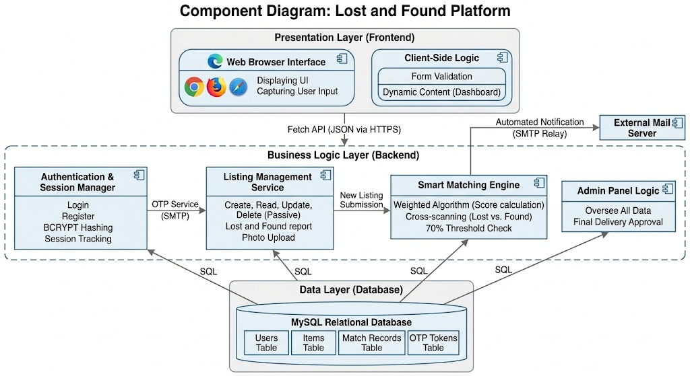

# Project Architecture: Lost and Found Information System

## Change History

## Table of Contents

# Table of Contents

1. [Project Scope](#1-scope)
2. [References](#2-references)
3. [Software Architecture](#3-software-architecture)
4. [Architectural Goals & Constraints](#4-architectural-goals--constraints)
5. [Logical Architecture](#5-logical-architecture)
6. [Process Architecture](#6-process-architecture)
7. [Development Architecture](#7-development-architecture)
8. [Physical Architecture](#8-physical-architecture)
9. [Scenarios](#9-scenarios)
10. [Size and Performance](#10-size-and-performance)
11. [Quality](#11-quality)

## [Appendices](#appendices)

- [Acronyms and Abbreviations](#acronyms-and-abbreviations)
- [Definitions](#definitions)
- [Design Principles](#design-principles)

---

## List of Figures

---

## 1. Scope

This application is a digital platform that facilitates the tracking of lost and found items on a university campus. Users can register to the system and create listings with photos for items they have found or lost. Thanks to the smart search feature in the system, it is possible to find a searched item in seconds by typing a category or name. In addition, there is an administrator (Admin) panel that oversees the entire process; this makes lost item tracking fast, reliable, and highly organized.

---

## 2. References

The technology stack and tools used in the development, testing, and deployment phases of the project are as follows:

### 2.1. Programming Languages and Technologies

- **PHP 8.x:** Used as the core engine on the server side (Backend) for processing form data, session management, and performing database CRUD (Create, Read, Update, Delete) operations.
- **MySQL:** Chosen as the project's relational database management system (RDBMS). Data integrity is ensured by establishing Foreign Key relationships between the users and items tables.
- **Web Standards (HTML5, CSS3, JS):** Semantic HTML is used for interface design, customized CSS (`style.css`, `profile.css`) for style management, and client-side JavaScript for dynamic user interactions.

### 2.2. Development and Server Environment

- **XAMPP Control Panel:** A software package used to simulate the Apache HTTP server and MariaDB/MySQL services on the local machine (localhost).
- **MySQL Workbench:** Used for designing database schemas, testing SQL queries, and visually managing table structures.
- **Visual Studio Code (VS Code):** The preferred integrated development environment (IDE) for managing the modular file structure and editing PHP/HTML files.

### 2.3. Version Control and Collaboration

- **Git & GitHub:** Used for team code synchronization, branch management, and tracking change history. So far, version tracking has been maintained with 38 commits on the project.

---

## 3. Software Architecture

The diagram below illustrates the high-level software architecture of the platform, utilizing a **decoupled, event-driven logical architecture**.

  

#### **Detailed Architecture Analysis**

**1. Presentation Layer (Frontend)**

- **`Web Browser Interface`:** Renders static HTML/CSS, ensuring cross-browser compatibility. Responsible for displaying UI and capturing input.
- **`Client-Side Logic`:** (JS Engines) Performs **Form Validation** and manages **Dynamic Content** (Dashboard) without full-page reloads.

**2. Business Logic Layer (Backend)**

- **`Authentication & Session Manager`:** Handles secure registration, **BCRYPT Hashing**, and **Session Tracking**. Triggers the `OTP Service (SMTP)` on user registration.
- **`Listing Management Service`:** Manages the lifecycle of reports (CRUD) and **Photo Upload**.
- **`Smart Matching Engine`:** Executes the core **`Weighted Scoring Algorithm`** and **`Cross-scanning`** (comparing lost vs. found) upon receiving a new listing event. Flags matches exceeding the **`70% Threshold`**.
- **`Admin Panel Logic`:** Allows administrative oversight and **Final Delivery Approval**.

**3. Data Layer (Database)**

- **`MySQL Relational Database`:** Ensures normalized and secure data persistence (Users, Items, Match Records, OTP Tokens).

**External Connection: `External Mail Server`**
Receives asynchronous data via **`Automated Notification (SMTP Relay)`** for match notifications or OTP dispatches.

---

## 4. Architectural Goals & Constraints

---

## 5. Logical Architecture

The system is built on a **3-Tier logical architecture** where responsibilities are clearly separated. This structure ensures that each layer focuses on its area of expertise and keeps the system modular:

1.  **Presentation Layer (Frontend):** The layer that directly interacts with the user. It consists of HTML, CSS, and JavaScript files gathered under the `frontend` folder. Rather than processing data, it visualizes the raw data coming from the Backend.
2.  **Business Logic Layer (Backend):** Positioned as the "brain" of the system, this is the PHP layer located in the `backend` folder. It manages critical processes such as user authorization, listing verification, and executing the smart matching algorithm.
3.  **Data Layer (Database):** The MySQL database where all data is securely kept in a relational structure. User profiles, listing details, and match records are stored here.

---

## 6. Process Architecture

During runtime, the system follows an asynchronous and data-driven process flow. The main processes are:

### Asynchronous Data Communication

The user interface communicates with the server without fully refreshing the page (Refresh-free). Requests are sent to the Backend using the JavaScript **Fetch API**, and the server returns data solely in JSON format. This process accelerates and streamlines the user experience (UX).

### Authentication and Session Management

When the login process is successfully completed, PHP initiates a session on the server side. This session information allows the Navbar and access privileges to change dynamically based on the user's role in the system (Admin/Student).

### Smart Matching Process

The system runs a two-way matching algorithm to maintain database accuracy and increase the speed of finding lost items. When a new found item is entered into the system, it is cross-referenced with existing lost item listings in the background. Similarly, when a new lost item listing is created, the system automatically scans the existing found item listings. The following weighted scoring formula is used in this process:

$$Score = (CategoryMatch \times W_0) + (LocationMatch \times W_1) + (DateMatch \times W_2)$$

If the calculated score is above the threshold value, the system automatically sends a notification to potential item owners.

---

## 7. Development Architecture

The development architecture is designed in a modular structure to ensure team collaboration and code maintainability.

### 7.1. Tech Stack

- **Languages:** PHP 8.x, HTML5, CSS3, Modern JavaScript (ES6+).
- **Database:** MySQL.
- **Development Tools:** VS Code, Apache (XAMPP).
- **Version Control:** GitHub. The entire development process is managed via GitHub to ensure code security and team synchronization.

### 7.2. File Organization and System Architecture

The project is structured in a layered folder hierarchy to facilitate team synchronization during development and make system maintenance sustainable.

**Root Directory Components:**
* **/docs:** The documentation layer containing the project's theoretical infrastructure, flowcharts, and use cases (diagrams).
* **ARCHITECTURE.md & README.md:** Main guides prepared for developers, containing the technical architecture and installation steps of the project.
* **.gitignore & .gitattributes:** Ensure the proper operation of the Git version control system and prevent the storage of unnecessary files (e.g., IDE configurations).

#### Detailed Analysis of src/ (Application Source Code)
All dynamic and static components of the application are gathered under the `src/` directory:

- **`/assets` (Static Resources):**
  - `/css`: `style.css`, `profile.css`, and `report_item.css`.
  - `/js`: JavaScript engines for form controls and dynamic listings.
  - `/images`: Secure storage for the system logo and user-uploaded item photos.
- **`/frontend` (Presentation Layer):** Forms and skeletons for `login`, `register`, `dashboard.html`, and `report_item.html`.
- **`/backend` (Business Logic Layer):**
  - `db_config.php`: Secure database connection bridge.
  - `login.php` & `register.php`: Authentication and OTP services.
  - `report_item.php`: Records new listings and triggers the matching algorithm.
  - `logout.php`: Securely terminates sessions.
- **`/database` (Data Layer):** `schema.sql` containing table structures and initial seeds.
- **`/docs`:** Documentation layer containing flowcharts and use cases.

### 7.3. Collaboration and Version Control

The entire development process was managed via GitHub to ensure code security, team synchronization, and systematic version tracking. The key advantages provided by this infrastructure are:

* **Chronological Development Log:** Through the consistent use of Git, every development phase was recorded with detailed commit messages, creating a transparent and traceable history of the project's evolution.
* **Stability and Debugging:** The version control system facilitated the debugging process by allowing the team to revert to previous states when necessary, ensuring that stable versions of the project were always secured.
* **Parallel Development (Decoupled Efficiency):** The architectural separation of the Frontend and Backend layers allowed Ali Kemal, Aydın, and the rest of the team to work on different modules simultaneously. This decoupled structure ensured that team members could develop and test their respective components independently without interfering with each other's code.

---

## 8. Physical Architecture

---

## 9. Scenarios

This section describes the end-to-end operational flow of the system, highlighting the interaction between the Frontend (JS), Backend (PHP API), and MySQL Database.

### Scenario 1: Posting a Lost Item (Student/User)

- **Action:** A student logs into the platform via `login.html.` The `auth.js` script verifies the session.
- **Process:** The student fills out the "Post Item" form, providing a mandatory date and an optional time.
- **Technical Flow:** Upon submission, JavaScript intercepts the event, collects data using the `FormData` object, and sends an asynchronous request to `backend/post_item.php` via the Fetch API.
- **Result:** The Backend validates the input and stores the data in the MySQL `items` table. The user is then dynamically redirected to `my_adverts.html` to view their active listing.

### Scenario 2: Smart Matching and Notification (System)

- **Action:** A user posts a "Found" item listing.
- **Process:** Immediately after the database update, the backend matching engine is triggered as an **Event-Driven** process.
- **Technical Flow:** The system compares the new entry against existing "Lost" items using a **Weighted Scoring Algorithm**
- **Result:** If the calculated Score exceeds the **70% threshold**, the system creates a record in the `match_records` table and displays a proactive notification on both users' dashboards.

### Scenario 3: Secure Password Recovery (User)

- **Action:** A user clicks "Forgot Password" on the login page.
- **Process:** The user provides their registered email address in `forgot_password.html`.
- **Technical Flow:** The backend generates a unique, time-sensitive **Security Token** and stores it in the MySQL database. An email containing a reset link is dispatched via **SMTP**.
- **Result:** The user follows the link to `reset_password.html` to update credentials. The token is invalidated immediately after use to ensure maximum system security.

### Scenario 4: Controlled Delivery Management (Admin)

- **Action:** The Admin navigates to the "Delivery" section in the `admin_panel.html`.
- **Process:** The Admin selects the recipient using a searchable dropdown filtered by **T.C. Identification Number**.
- **Technical Flow:** The admin enters the unique IDs of the matched items. The `backend/deliver_item.php` script updates the status of both items from **Active** to **Passive**.
- **Result:** Once delivery is confirmed, the relevant listing is moved from the **"My Active Listings"** tab to the **"My Found Items / My Past Listings"** tab in the user's dashboard.The records are not deleted from the system; they remain stored in the database as proof of delivery and a transaction history for both the user and the administrator.

---

## 10. Size and Performance

The system is engineered for efficiency, utilizing a lightweight architecture to ensure high responsiveness and low resource consumption.

### 10.1. System Size
* **Lightweight Codebase:** By separating concerns into `/frontend` and `/backend`, redundant code has been eliminated. The application maintains a minimal footprint, consisting primarily of optimized script files and lean HTML structures.
* **Data Efficiency:** The MySQL database is designed with optimized data types (e.g., `INT` for IDs, `DATETIME` for timestamps, and `VARCHAR` for strings) to minimize disk space usage while maintaining data integrity.
* **Asset Management:** The `/assets` folder is strictly reserved for essential media, such as the corporate logo. This keeps the initial load size very small, as decorative elements are handled via CSS within the frontend directory.

### 10.2. Performance Metrics
* **Low Latency Communication:** Using the **Fetch API** to exchange only JSON data (rather than full HTML pages) reduces network traffic by up to **70%**. This results in near-instantaneous UI updates and transitions.
* **Search Optimization:** Admin searches are performed on **indexed columns** (specifically the T.C. Identification Number). This ensures that even with a database of thousands of students,search results are returned in milliseconds.
* **Concurrency and Scalability:** When a user creates a new listing, the system executes the cross-matching algorithm in the background. Thanks to the **asynchronous** nature of the Fetch API, the User Interface (Frontend) remains unblocked, providing a smooth experience even under high traffic conditions.
* **Server Response Time:** API endpoints are optimized for speed, aiming for a response time of **less than 100ms** per request under normal campus network load conditions.

---

## 11. Quality

### 11.1. Security & Privacy

- **Identity Verification (OTP):** The One-Time Password (OTP) system sent to the user's email address during registration prevents fake accounts and verifies user identity upfront.
- **Confidentiality:** There is no direct communication between the losing and finding parties. The entire process is conducted via the **Campus Security Unit**, preserving user anonymity.
- **RBAC (Role-Based Access Control):** The **_"Principle of Least Privilege"_** is applied. The Admin (Security) can access all data, while users can only see their own listings.
- **Data Protection:** Passwords are hashed using **BCRYPT**; all form inputs are cleaned against **SQL Injection** and **XSS attacks.**

### 11.2. Reliability & Integrity

- **Two-Step Verification:** The verification information sent to the user via email after a match is checked by the security officer during the physical delivery process.
- **Visual Proof:** The mandatory photo upload for "Found Item" reports increases the accuracy and evidentiary value of the data in the system.
- **Transaction Consistency:** Database operations work cohesively to prevent data loss during **reporting and matching.**

### 11.3. Performance & Efficiency
*   **Automated Matching Engine:** _The Matching Algorithm_, which runs when a new lost or found listing is entered, digitizes the manual search process by calculating the similarity score between listings and minimizes the ***MTTR (Mean Time To Recover)***.
*   **Proactive Email Notification:** Without the need for the user to constantly check the system, instant and proactive notifications are provided via the Email Notification Service for matches exceeding the 70% threshold.
*   **Database Indexing:** Category and location-based indexing ensure fast querying even with a high volume of records.

### 11.4. Usability & UX
*   **Personalized Interfaces:** Dashboard menus customized by user's role.
*   **Mobile Responsiveness:** All interfaces are mobile-responsive so the system can be easily used anywhere on campus at any time.
*   **Location-Based Filtering:** Customized categorization based on campus buildings increases search accuracy.

### 11.5. Maintainability & Audit

- **Modular Architecture:** Backend logic (matching algorithm, notification service, DB connection) consists of _independent modules_, making development and debugging straightforward.
- **Audit Trail:** Every delivery transaction is logged with the receiver, the approving officer, and a timestamp, creating a secure digital audit trail.

---

## Appendices

### Acronyms and Abbreviations

### Definitions

| Term                            | Definition                                                                                                                                                                         |
| :------------------------------ | :--------------------------------------------------------------------------------------------------------------------------------------------------------------------------------- |
| **Asynchronous (Non-blocking)** | A method where operations run independently without waiting for each other. This ensures the UI remains responsive while the Fetch API performs matching in the background.        |
| **BCRYPT**                      | A password-hashing function based on the Blowfish cipher, used to securely store user credentials in a non-reversible format.                                                      |
| **Endpoint**                    | Specific URLs or server-side scripts (e.g., `login.php`) that act as a gateway for the Frontend to communicate with the Backend.                                                   |
| **Event-Driven**                | A software architecture paradigm where the flow of the program is determined by events, such as a new data entry triggering the matching algorithm.                                |
| **Fetch API**                   | A modern JavaScript interface for making asynchronous HTTP requests to the server without requiring a full page reload.                                                            |
| **Hashing**                     | The process of converting data (passwords) into a fixed-length string of characters that cannot be reversed, ensuring security even if the database is compromised.                |
| **MTTR**                        | _Mean Time To Recover._ In this context, it refers to the average time taken from the moment an item is reported lost to its successful recovery.                                  |
| **OTP**                         | _One-Time Password._ A unique, time-sensitive code sent via email to verify a user's identity during the registration or password recovery process.                                |
| **Payload**                     | The essential part of a transmitted data package. In this project, it refers to the JSON data sent within an HTTP request (e.g., item details).                                    |
| **RBAC**                        | **Role-Based Access Control.** A security mechanism that restricts system access to authorized users based on their roles (e.g., Admin vs. Student).                               |
| **RDBMS**                       | **Relational Database Management System.** A database engine (like MySQL) that organizes data into tables linked by defined relationships.                                         |
| **SMTP**                        | **Simple Mail Transfer Protocol.** The technical standard for transmitting automated email notifications from the application server.                                              |
| **UX**                          | **User Experience.** The overall experience of a person using the application, optimized in this project through responsive design and asynchronous updates.                       |
| **XSS**                         | **Cross-Site Scripting (XSS):** A security vulnerability whereby malicious scripts are injected into trusted websites; in this project, this is prevented through input filtering. |
=======

### Design Principles

- **Single Responsibility Principle (SRP)**
- **Event-Driven Execution**
- **Non-Blocking Communication (Asynchrony)**
- **Separation of Concerns (SoC)**
- **Layered Architecture**
- **Principle of Least Privilege (PoLP)**
- **Decoupled Frontend-Backend**
- **High Cohesion / Low Coupling**
- **Simplicity**
- **Zero-Exposure Strategy**
- **Normalized Data Design**
